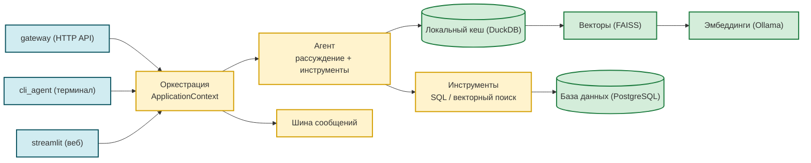

# nanobot — Personal AI Agent (Deployment)

Локальная инсталляция фреймворка **[nanobot-ai](https://github.com/HKUDS/nanobot)**
(PyPI: `nanobot-ai`) с кастомными доработками: PostgreSQL-каналы, Redis, Streamlit UI,
бенчмарки, навыки `audit_analyzer`, `legal_summarizer`, `office_files` и
`follow_up` (отдельный MCP-процесс, код — в папке навыка).

> **Агент:** Aura (🐈) · **Модель:** OpenAI-compatible · **ОС:** Windows · **Язык:** RU/EN

## 🚀 Быстрый старт

```bash
python -m venv .venv && .venv\Scripts\activate
pip install nanobot-ai && pip install -r requirements.txt
copy .secrets.env.example .secrets.env   # cp на Linux
# Отредактируйте .secrets.env: DB_PASSWORD=... и # providers: llm / api_key=...
python tools/migrate.py --apply         # применить миграции схемы
python gateway.py                        # AgentLoop + Postgres/Redis каналы + Streamlit :8501
# или:
python cli_agent.py -P -s dev           # REPL в patched-режиме (PostgreSQL)
```

Минимальный набор таблиц (если нет `migrate.py`):

```bash
psql -d nanobot -f sql/session/create_public_agent_session_meta.sql
psql -d nanobot -f sql/session/create_public_agent_session_messages.sql
psql -d nanobot -f sql/channels/create_public_agent_conversation_messages.sql
```

Полный список DDL — в [`sql/README.md`](sql/README.md).

## 🛠 Команды

```bash
python gateway.py                                                 # долгоживущий сервер
python cli_agent.py                          # REPL vanilla (JSONL)
python cli_agent.py -P -s my-session         # REPL patched (PGSessionManager + хуки)
python benchmarks/runner.py --tags simple                         # оценка качества
python tools/build_vectors.py --full-rebuild                      # перестроение FAISS-индексов
python tools/build_vectors.py --status                            # текущее состояние
python tools/check_worker_pool_integrity.py --fix                 # диагностика пула воркеров
python tools/migrate.py --apply                                   # миграции схемы
```

> **Навык `audit_analyzer`** предоставляет CLI `scripts/cli.py --mode <predefined | generated_sql | vector>`
> (вызывается агентом через `exec`; также для бенчмарков/CI). Generic tools
> `duckdb_query` / `vector_search` удалены в фазе 8 — агент работает только через CLI.
> LLM-генерация SQL — режим `generated_sql` (`scripts/generated_sql_mode.py`, прямой вызов `lib.services.llm_client`).
> Внешний контракт — `SKILL.md`.

Подробности по каждой команде — в [docs/INTERNAL_API.md](docs/INTERNAL_API.md) и
[docs/TROUBLESHOOTING.md](docs/TROUBLESHOOTING.md).

## 🏗 Архитектура



**Поток:** 3 конфига → `config.py: SETTINGS` → `ApplicationContext.create()` →
`MessageBus` → `AgentLoop` → `gateway.py`/`cli_agent.py` запускают каналы + lifecycle.
Полная таблица связей — в [docs/ARCHITECTURE.md](docs/ARCHITECTURE.md).

## 📁 Структура проекта

```
nanobot/
├── README.md  CHANGELOG.md  AGENTS.md
├── config.json  project.json  config.py        # 3 конфига
├── gateway.py  cli_agent.py  streamlit_app.py  # точки входа
├── lib/                          # сервисный слой: core, services, cli, hooks,
│                                 #   lifecycle, channels, session, utils, commands
├── workspace/                    # runtime, hooks-плагины, skills, memory
├── tests/  benchmarks/  tools/  sql/  docs/  requirements.txt
```

Подробное дерево — в [docs/ARCHITECTURE.md → Структура проекта](docs/ARCHITECTURE.md#структура-проекта).
Навигация по `docs/` — в [docs/README.md](docs/README.md).

## 🗃 База данных

DDL в `sql/<domain>/create_<schema>_<table>.sql` (один файл = одна таблица).
Миграции — `python tools/migrate.py --apply`. Слои:

- **Сессии:** `public.agent_session_meta`, `public.agent_session_messages`
- **Канал:** `public.agent_conversation_messages`
- **Журнал:** `public.agent_gateway_logs`, `public.agent_question_runs` (UUID + JSONB)
- **Домен audit_analyzer:** `oarb.audits/violations/audit_reports/report_items` (REFERENCE)
- **Векторы:** `oarb.audit_vectors` (эмбеддинги), `public.agent_vector_index_store` (FAISS BYTEA + signature); `public.agent_vector_index_config` — legacy SQL-артефакт (кодом не читается; конфиг индексов — в `project.json::gateway.vector.index.indexes`)
- **Predefined scripts:** `public.agent_predefined_scripts`
- **Воркер-пул:** `public.agent_worker_claims` (UNIQUE PK, lease)
- **Бенчмарки:** `public.agent_benchmark_runs/results`

> Имена таблиц/индексов выше — значения текущей инсталляции (REFERENCE). Они
> настраиваются в `project.json` (`channels.postgres.*`, `skills.audit_analyzer.tables[]`/`vector_indexes[]`, `gateway.vector.index.*`, `logging.db.*`, `benchmark.*`) и в других развёртываниях могут отличаться.

Реестр таблиц PG → DuckDB — в [docs/table-registry.md](docs/table-registry.md).

## 🧪 Тестирование

**2365 unit-тестов** (интеграционные пропускаются без живого PostgreSQL/LLM).

```bash
pytest tests/ -q
pytest tests/ --cov=lib --cov-report=term-missing
```

Группы: `test_application_context.py` + `test_*_factory.py` · `test_runtime_patcher.py`
+ `test_utils_db.py` · `test_*_service.py` (db_logging, audit, transcription) ·
`test_pg_session_manager.py` + `test_*_channel.py` · `test_hooks_*.py` +
`test_recent_files_hook.py` + `test_office_files.py` · `test_benchmarks_*.py` +
`test_gateway*.py` + `test_cli_agent.py`.

## ⏰ Heartbeat и cron

`nanobot gateway` запускает встроенный heartbeat-cron, который периодически проверяет
`HEARTBEAT.md` (`gateway.heartbeat.enabled=true`, `intervalS: 1800`). Не дублируйте его.

- Периодическая проверка → правьте `HEARTBEAT.md`.
- Одноразовое напоминание → встроенный `cron` tool opencode.
- Политика storage и cron для агента — в [`workspace/AGENTS.md`](workspace/AGENTS.md).

> [!WARNING]
> Не пишите напоминания только в `MEMORY.md` — это не вызывает уведомлений.

## 📚 Документация

| Документ | Назначение |
|---|---|
| **[docs/README.md](docs/README.md)** | Навигационный индекс каталога документации (разделы, нормативная архитектура, конвенции) |
| **[docs/TARGET_ARCHITECTURE.md](docs/TARGET_ARCHITECTURE.md)** | Нормативный архитектурный контракт (принципы, invariant'ы, anti-patterns, decision-чеклист) |
| **[CHANGELOG.md](CHANGELOG.md)** | История релизов (Keep a Changelog / SemVer) |
| **[docs/TROUBLESHOOTING.md](docs/TROUBLESHOOTING.md)** | Диагностический runbook |
| **[docs/MIGRATION.md](docs/MIGRATION.md)** | Сводка изменений между релизами + breaking changes |
| **[docs/table-registry.md](docs/table-registry.md)** | Реестр таблиц PG → DuckDB |
| **[docs/skill-tool-architecture.md](docs/skill-tool-architecture.md)** | Контракт Skill ↔ Tool |
| **[docs/architecture/](docs/architecture/)** | Инвентаризация зависимостей и monkey-patch'ей |
| **[benchmarks/README.md](benchmarks/README.md)** | Бенчмарки: модели, YAML, веса |
| **[lib/channels/README.md](lib/channels/README.md)** | Каналы (Postgres/Redis): DDL, поток, конфиг |
| **[lib/session/README.md](lib/session/README.md)** | `PGSessionManager`: схема, graceful degradation |
| **workspace/skills/*/SKILL.md** | Документация навыков |
| **workspace/AGENTS.md** | Инструкции для агента |

## 🆕 Что нового в v2.5.2

**PATCH поверх v2.5.1, 2026-09-14.** Две группы доработок:

**NFS / DuckDB cache.** Раньше gateway, развёрнутый на NFS-шаре, цикл
sync-а падал с `IO Error: Could not set lock on file cache.duckdb.tmp:
Conflicting lock is held in PID 0` (DuckDB `ATTACH` берёт эксклюзивный
`flock`, который NFS `lockd` не отдаёт). Теперь:
- **единый механизм** `resolve_publish_path()` — вызывается и из
  gateway, и из CLI/skill/vector_index_service; путь записи и путь
  чтения **всегда совпадают** (`b1d2e21`, fix от расхождения после
  коммита `85cad2a`);
- safe default — `~/.cache/nanobot/duckdb/cache.duckdb` (POSIX `fcntl`
  работает там штатно), без escape hatch и без совместимости с NFS
  (`85cad2a`);
- единственная опция override — `gateway.cache.local_path` (`c522b55`);
  legacy `<workspace>/data_store/duckdb/` больше не выбирается
  через `gateway.cache.use_workspace_path` — опция удалена;
- startup WARNING при попадании снимка на NFS (`/proc/mounts` check);
- defensive publish-слой: уникальный `.tmp.<pid>.<ms>.tmp`, retry с
  backoff на `ATTACH`, понятный `sync_publish_failed` вместо
  `except OSError: pass` (`605660b`, `652b09d`).

**Observability sync-путей.** Единый конвейер `emit_sync_event` /
`DbLoggingService` вместо ad-hoc `logger.warning` (`a1811c5`); ошибки
`preload` векторов и `channel` lease-loop теперь попадают в долговечный
`agent_gateway_logs` (`9fb88c4`, `48575e9`); `PG→DuckDB` sync-цикл
(`initial_load` / `poll_cycle` / `claim` / `release` / `reconnect`)
полностью пишется в `agent_gateway_logs` (`f58c957`, `d4558f9`).

**Tests:** добавлены `TestResolvePublishPath` (6 кейсов),
`TestSingleMechanism` (1 кейс — инвариантна согласованности gateway ↔
CLI/skill) и `TestWarnIfPublishPathOnNfs` (2 кейса); все ранее
падавшие тесты (включая `preload_service::test_error_returns_none`)
зелёные.

**Audit-analyzer three-mode contract (`a396c27`).** `audit_analyzer`
свёрнут в три равноправных режима — `predefined`, `vector`,
`generated_sql` — **без fallback между ними**. Удалён
`scripts/column_hints.py` и прежний registry: схема передаётся в LLM
через `CacheProvider.get_schema()` +
`lib.utils.sql_safety.format_schema`, few-shot — через
`predefined.db_loader.load_all`. Если выбранный режим неприменим,
агент получает явный `RuntimeError` с диагностикой, а не молчаливый
переход на соседний режим.

**Vector discovery: declared vs runtime (`61ead9b`).**
`audit_analyzer/scripts/cli.py::_list_indexes()` теперь читает
фактическое состояние FAISS-blob'ов из `public.agent_vector_index_store`
(PG), а не декларативный JSON. Для сверки с декларацией
(`project.json::gateway.vector.index.indexes.*`) добавлен
`tools/check_indexes.py`: MISSING / ORPHAN / STALE / INVALID-signature,
exit 0/1/2, `--json` для CI. См. `docs/VECTOR_INDEXES.md`.

**Preload health summary на старте gateway (`78a57f4`).** После
`preload_vector_indexes()` gateway печатает в **stderr** многострочный
summary (`declared/loaded/missing/orphan/stale` + счётчики vectors) и
пишет одно событие `vector_index_preload_health` в `agent_gateway_logs`
через `emit_sync_event`: `level="WARN"` при divergence, иначе `INFO`.
Конструктор `PreloadService(settings, db_logging_service)` —
сервис логирования пробрасывается явно.

**Tests (полный набор):** добавлены `TestResolvePublishPath` (6),
`TestSingleMechanism` (1 — инвариантна gateway ↔ CLI/skill),
`TestWarnIfPublishPathOnNfs` (2), `test_check_indexes` (17 — declared vs
runtime), `test_preload_service` (+18 health summary, всего 22),
`test_audit_analyzer_mode_selection` (переписан под three-mode),
`test_audit_analyzer_generated_sql` (обновлён под `MAX_ATTEMPTS`).

Полный changelog — в [CHANGELOG.md → 2.5.2](CHANGELOG.md#252--2026-09-14).

## 🆕 Что нового в v2.5.1

**PATCH поверх v2.5.0, 2026-09-13.** Регрессии и доработки после MINOR-релиза — закрытие
lifecycle-deadlock `postgres_channel` при `stream_end` с пустым delta (`71cfcde`),
удаление agent-tools `duckdb_query` и `vector_search` (Phase 8 Resource Model
Refactoring, `12bf182`), перенос конфига vector-индексов из PG-реестра
`public.agent_vector_index_config` в `project.json::gateway.vector.index.indexes.*`
+ хардкод эмбеддинга (`bf59b5a`), DB-first `scripts/predefined` в `audit_analyzer`
+ удаление `tools/generate_predefined_scripts_sql.py` (`79e0e63`),
`tools/build_vectors.py --validate-only` + ETA прогресса (`8b70383`), стабилизация
порядка таблиц в `lib/utils/duckdb_query.build_schema` (`a8e03e8`), перенос тестов
`audit_analyzer` в `workspace/skills/audit_analyzer/tests/` (`10771cc`),
синхронизация архитектурной документации и README «Что нового».

Изменения конфигурации: `config.json` — провайдер LLM `qwen3.6-35b-a3b` через
`https://api.neuraldeep.ru/v1/`, `contextWindowTokens: 40000` (см. `e06b2b0`).

Полный changelog — в [CHANGELOG.md → 2.5.1](CHANGELOG.md#251--2026-09-13).

## 🆕 Что нового в v2.5.0

**MINOR поверх v2.4.0, 2026-09-11.** Крупный рефакторинг `legal_summarizer` (97-этапный
план: layered package, document-level cache, brief как ровно один Chunk, structural
packing, вопрос-режим через document cache, e2e 3-mode CLI), переработка
конфигурационного контракта skills ↔ runtime infrastructure (`TableRegistry.register_infra`,
`gateway.vector.{embedding,index}.*`, `EmbeddingSettings`, hard validation legacy-ключей),
generic infrastructure tools (`duckdb_query`, `vector_search`, `nl_sql_generate`,
`column_descriptions`, `history_search`, `compact_context`), SQL AST-security-guard,
миграции схемы, сервисы времени жизни (`ContextCompactionService`,
`RuntimeHealth`/`RuntimeReadiness`, `ConsolidatorLocale`), перенос утилит
`lib/utils/*` (media/jsonb/outbound) → `workspace/utils/*`, vector-storage как
инфраструктурный ресурс, ремедиация compatibility-shim долга, history_search FTS-baseline.
Подробный эпиграф с breaking changes — в начале блока v2.5.0.

Полный changelog — в [CHANGELOG.md → 2.5.0](CHANGELOG.md#250--2026-09-11).
Сводка breaking changes — в [docs/MIGRATION.md](docs/MIGRATION.md).

## 🛡 Зависимости и лицензия

`nanobot`, `psycopg2-binary`, `redis`, `streamlit`, `loguru`, `httpx`, `duckdb`,
`faiss-cpu`, `numpy`, `pyarrow`, `PyYAML` — точные версии в `requirements.txt`.

**Лицензия:** MIT.
