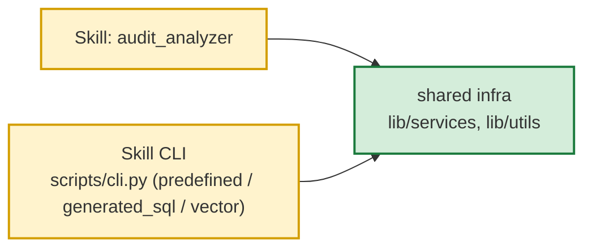

# Skill / Tool inventory

Зафиксированное состояние после рефакторинга `refactor/skills-tools-cleanup`
(коммиты `c593d509`..`7d8f6b0`; слито в `master` @ `bb844cf`).

Baseline до старта рефакторинга — в [docs/refactor_baseline.md](refactor_baseline.md).

## Сводная таблица

| component | path | type | depends_on_skill | depends_on_tool | depends_on_shared_infra | status |
|---|---|---|---|---|---|---|
| `audit_analyzer` Skill | `workspace/skills/audit_analyzer/SKILL.md` + `scripts/` | Skill (domain, **CLI**) | — | следование SKILL.md через CLI `scripts/cli.py --mode predefined` (агент); CLI `--mode <predefined \| generated_sql \| vector>` для бенчмарков/CI/operator | — | active |
| `legal_summarizer` Skill | `workspace/skills/legal_summarizer/SKILL.md` + `references/` + `scripts/` | Skill (domain) | — | через собственный skill-side CLI; follow-up через tool `legal_summarizer_query` | `lib/services/llm_client.py` | active |
| `office_files` Skill | `workspace/skills/office_files/SKILL.md` + `references/` + `scripts/` | Skill (domain) | — | чтение docx/xlsx/xls/pdf/pptx/csv/txt через `workspace/utils/office_files.py` + `lib/services/text_splitter.py` | — | active |
| `follow_up` Skill | `workspace/skills/follow_up/SKILL.md` + `backend/` (сервер) + `scripts/follow_up_mcp` (лаунчер) | Skill (domain, **отдельный MCP-процесс**) | — | инструменты `mcp_follow_up_*` через `config.json::tools.mcpServers.follow_up` (штатный MCP `nanobot-ai`); тот же Python, модель, GP и схема — из настроек агента | — | active |
| `compact_context` tool | `workspace/tools/compact_context.py` | Tool | — | — | `lib/services/context_compaction.py` | active |
| `history_search` tool | `workspace/tools/history_search_tool.py` | Tool (generic infrastructure) | — | — | `agent_gateway_logs` (долговечный журнал) | active |
| `legal_summarizer_query` tool | `workspace/tools/legal_summarizer_query.py` | Tool | `legal_summarizer` (follow-up по сохранённой `operation_id`) | — | skill CLI `cli_query.py` + `data_store/cache/skills/legal_summarizer/<op_id>/` | active |
| `example_tool` | `workspace/tools/example.py` | Tool (template) | — | — | — | reference |

## Удалённые компоненты

| component | бывший путь | замена |
|---|---|---|
| `duckdb_query` tool | `workspace/tools/duckdb_query_tool.py` | CLI skill'а `scripts/cli.py --mode predefined` (фаза 8; прямой доступ агента к свободному SQL удалён) |
| `vector_search` tool | `workspace/tools/vector_search_tool.py` | CLI skill'а `scripts/cli.py --mode vector` (фаза 8; прямой доступ агента к vector-search удалён) |
| `run_predefined_script` tool | `workspace/tools/run_predefined_script.py` | CLI skill'а `scripts/cli.py --mode predefined --script <name>` / `predefined.run()` (реестр в `public.agent_predefined_scripts`, см. `SKILL.md`) |
| `nl_sql_generate` tool | `workspace/tools/nl_sql_generate.py` | CLI skill'а `scripts/cli.py --mode generated_sql` (LLM-генерация SQL) |
| `column_descriptions` tool | `workspace/tools/column_descriptions.py` | `SKILL.md` секции «Схема домена» + «SQL guidance» (Agent читает сам) |
| `NlSqlRunner` core | `lib/services/nl_sql_runner.py` | не используется (NL→SELECT pipeline выпилен) |
| `SchemaFormatter` core | `lib/services/schema_formatter.py` | не используется |
| `ColumnDescriptionsResolver` core | `lib/services/column_descriptions.py` | не используется |
| `PredefinedScriptRegistry` core | `lib/services/predefined_script_registry.py` | реестр `public.agent_predefined_scripts` (DB-first; Python `REGISTRY`/`scripts/predefined/scripts.py` удалены в фазе 7) |
| `PredefinedScriptRequestBuilder` core | `lib/services/predefined_script_request.py` | `scripts/predefined/builder.py::DynamicQueryBuilder` (inline `?`-подстановка в SQL из реестра skill'а) |
| `ParameterValidator` core | `lib/services/predefined_script_validator.py` | не используется |
| `audit_run_predefined_script` tool | `workspace/tools/audit_analyzer_tool.py::AuditRunPredefinedScriptTool` | CLI skill'а (`scripts/cli.py --mode predefined --script <name>`) |
| `audit_search_vector` tool | `workspace/tools/audit_analyzer_tool.py::AuditSearchVectorTool` | CLI skill'а `scripts/cli.py --mode vector` (с указанием `index_name`) |
| `audit_generate_sql` tool | `workspace/tools/audit_analyzer_tool.py::AuditGenerateSqlTool` | CLI skill'а `scripts/cli.py --mode generated_sql` (LLM-генерация SQL) |
| `audit_analyzer_tool.py` | `workspace/tools/audit_analyzer_tool.py` (файл целиком) | три tool'а выше + замены |
| `audit_analyze.bat` / `audit_analyze.sh` | `workspace/skills/audit_analyzer/audit_analyze.{bat,sh}` | прямой запуск `python scripts/cli.py --mode ...` (см. бенчмарки) |
| `scripts/__init__.py` (skill) | `workspace/skills/audit_analyzer/scripts/__init__.py` | legacy-фасад (никем не импортировался) |
| `tests/e2e_test.py` (skill) | `workspace/skills/audit_analyzer/tests/e2e_test.py` | standalone (не pytest) |
| `scripts/generated/` | `workspace/skills/audit_analyzer/scripts/generated/` | одноразовый dump-скрипт |
| `providers.py` (навыка) | `workspace/skills/audit_analyzer/providers.py` (наброски без регистрации) | удалён — регистрация через `ApplicationContext._auto_register_skills()` |

## Последующие изменения (после слияния в `master`)

После первоначального рефакторинга на ветке `master` (HEAD `bb844cf`) закреплены
дополнительные границы конфигурации:

- **Конфигурационная граница `skills.*`**: секции `embedding` и `cache` вынесены
  из `skills.<name>` на уровень общей runtime-инфраструктуры `gateway.vector.*`.
  `SkillSettings` теперь имеет `model_config = ConfigDict(extra="forbid")`
  (fail-fast на опечатках и legacy-ключах). Регистрация embedding —
  `lib.core.skill_registration.register_embedding_config` удалена
  (Resource Model Refactoring): параметры эмбеддера захардкожены
  в `cache_provider_impl` (`_EMBED_*`-константы), токен — из переменной
  окружения `EMBED_TOKEN`. Секция `gateway.vector.embedding` удалена.
- **`tools/build_vectors.py`** стал generic: убран hardcoded `audit_analyzer`,
  источник индексов — `gateway.vector.index.indexes` в `project.json`
  (PG-реестр `public.agent_vector_index_config` — legacy-артефакт,
  кодом больше не читается). Коммит `bb844cf`.
- **Embedding `auth_token`** (bearer) поддерживается через
  переменную окружения `EMBED_TOKEN` (см. `cache_provider_impl._EMBED_TOKEN_ENV`).

## Целевая зависимость (после рефакторинга)

Контракт и инварианты — в [docs/skill-tool-architecture.md](skill-tool-architecture.md)
(TARGET_ARCHITECTURE.md §4, §22.1, §22.2, §28). Tools `duckdb_query` /
`vector_search` удалены в фазе 8 — Agent-доступ к `audit_analyzer` только
через CLI `--mode predefined`. Любое падение
`tests/test_skill_tool_independence.py` / `tests/test_architecture_tool_domain_free.py` /
`tests/test_core_infrastructure_independence.py` — архитектурная регрессия.